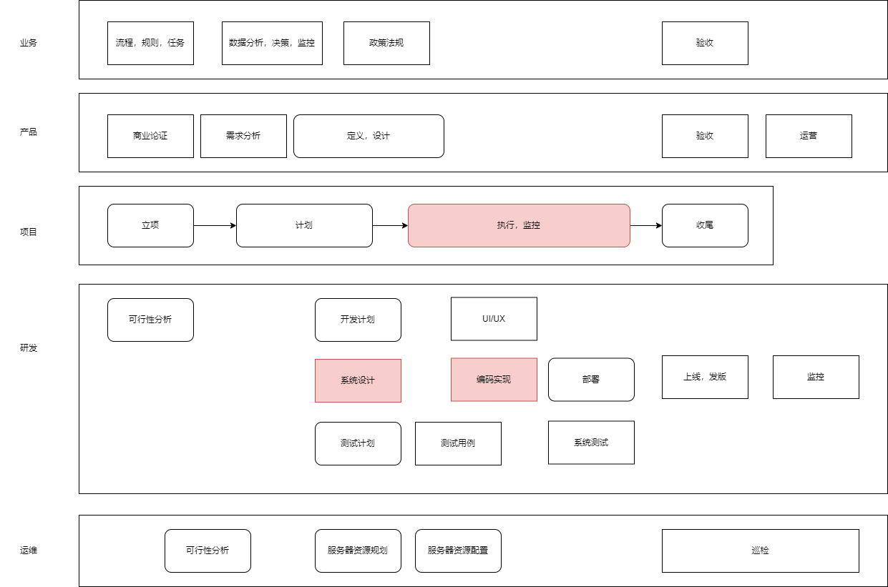

成功开发一款软件，个人、组织、公司将会面临很多挑战。在这里我们将努力探索最佳产品研发过程。

# 创业、创新与商业
* [产品](product.md)

# 设计、构建
* [系统分析和设计](design.md)
* [软件构建](build.md)

# 过程、管理
* [研发过程、运营](engineer.md)
* [项目管理](project.md)

# 组织、企业经管
* [公司、效益](company.md)

为了更好的生活，下面的链接也适合你
> [生活篇 作为地球人类的知识框架](https://github.com/codefossil/livingbook)