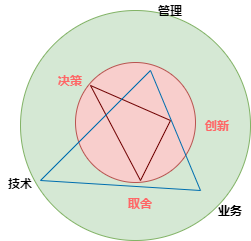

[essential skills for the agile developer]

# 软件工程师人性、个人发展

> 工程师的一天=编码+设计文档+解bug

[The Humble Programmer, turing lecture](https://dl.acm.org/doi/10.1145/355604.361591)

[Clean Coder, 2011](https://book.douban.com/subject/11614538/) 

[The Complete Software Developer's Career Guide, sonmez2017](https://book.douban.com/subject/35043940/)  
软件开发不仅仅是编程，在此之前还需要理清需求（大多数软件项目的目的都是自动化）、适量的设计，写完之后还要调试、测试、部署和监控。  

学习一门新的编程语言最佳实践：真实的项目->Hello World->学习基本的构建模块->区分语言内置特性和标准库->理解并build现有代码->刷题。  

程序员的手艺：开发语言（编译和运行平台、库和框架）、代码结构设计、OOD、算法和数据结构、数据库、源码控制、测试和调试、构建和部署、软件开发方法。  

[cracking the coding interview](https://book.douban.com/subject/26570695/)

[剑指Offer](https://book.douban.com/subject/25910559/)

[软技能](https://book.douban.com/subject/26835090/)  
至今为止看到软件开发工程师职业最强指南。  
**拥有商业心态**，把雇主当做软件开发企业的客户。  
每个人都希望自己很重要。  
**在一个专业方向上拥有专长**，思考专业化道路是会让自己受益，还是过度限制了自己的选择，类比律师。    
同时保有全职工作、开源节流、业余时间2小时/天新业务试错。  
持续不断增强业务能力，**确保长期客户、稳定的新客户**。  
作为一名软件开发人员，拥有成为一名企业家得天独厚的优势，不仅能提出概念和想法，还能把它创造出来。  
建立长远的理财思维，考虑物品的实际开销。  
**制定退休计划**，一方面缩减每个月的开支；一方面增加和确保自己的被动收入，包括且不仅限于购买增长型期权、高收益股票、基金、可租赁房产、存入退休账号、版权。  
退休=财务自由=不会由于财务状况用自己别无选择的方式，将自己的时间花费在不合心意的事情上。  

[The Effective Engineer, Lau2015](https://book.douban.com/subject/26360716/)

[Apprenticeship Patterns: Guidance for the Aspiring Software Craftsman, hoover2010](https://book.douban.com/subject/4924164/)

[卓有成效的程序员](https://book.douban.com/subject/3558788/)

[Pragmatic Thinking and Learning, hunt2011](https://read.douban.com/ebook/1885884/)

[The Seven Stages of Expertise in Software Engineering](http://www.wayland-informatics.com/The%20Seven%20Stages%20of%20Expertise%20in%20Software.htm)

[新事物炒作曲线(un-confirmed), gartner](https://en.wikipedia.org/wiki/Hype_cycle)

[代码精进之路：从码农到工匠](https://book.douban.com/subject/34922776/)

[Engineers Survival Guide](https://www.amazon.com/Engineers-Survival-Guide-Facebook-Microsoft/dp/B09MBZBGFK/ref=d_pd_sbs_sccl_2_3/138-8628425-9428532?pd_rd_w=4ov1F&content-id=amzn1.sym.3676f086-9496-4fd7-8490-77cf7f43f846&pf_rd_p=3676f086-9496-4fd7-8490-77cf7f43f846&pf_rd_r=B9J3B1NF1DBF4EXBRVBA&pd_rd_wg=Re3co&pd_rd_r=dc2e9acc-741e-4f62-be43-e927a2b7cd88&pd_rd_i=B09MBZBGFK&psc=1)

skill and self-evaluation

https://firstround.com/review/Responsiveness-New-Efficiency/  

http://www.cs.toronto.edu/~sme/CSC340F/  

https://simplicable.com/new/coding-principles  
https://about.gitlab.com/handbook/  
https://en.wikipedia.org/wiki/List_of_software_development_philosophies
http://blog.vgod.tw/
https://blog.youxu.info/
http://blog.54chen.com/
http://www.yankay.com
http://www.valleytalk.org

http://people.scs.carleton.ca/~deugo/Patterns/ospdg/
https://www.cs.cmu.edu/~aldrich/courses/413/

写给工程师的十条精进原则  
https://tech.meituan.com/2018/08/16/10-principles-for-engineers.html

https://www.cnblogs.com/cicada-smile/p/14579547.html

从码农到技术总监，如何提升自我修养？
https://new.qq.com/omn/20190824/20190824A049H300.html?pc  

Why Motivating People Doesn't Work . . . and What Does  
https://www.amazon.com/Motivating-People-Doesnt-Work-What/dp/1626569452/ref=sr_1_18?crid=U700ZYNJZF0A&keywords=microservice&qid=1650727070&s=books&sprefix=microserv%2Cstripbooks-intl-ship%2C1149&sr=1-18

# 架构师职业、核心价值、软技能

> The most important single ingredient in the formula of success is knowing how to get along with people.

[ch22~ch24 Fundamentals of Software Architecture, ford2020](https://book.douban.com/subject/34464806/)  

定义架构决策，指导开发团队做技术决策。  
持续的学习新的技术和趋势。  
确保团队遵循架构决策和设计原则。  
多经历不同的框架、库、技术、平台和环境。  
多了解业务知识。  
构建自己的个人能力，包括团队合作、协调能力、领导力。  
架构师做的每个决定几乎都会遭到质疑，需要斡旋能力。  
团队管理指导力度=团队熟悉程度+团队大小+经验水平+项目复杂度+项目时长。  
团队不健康警告指标=过程损失+多元无知+旁观者效应。  
高效的架构师通过榜样作用领导团队，而不是title。  
对于架构师来说，知识的宽度比深度更重要。 

## 业务能力成熟度
https://jiagoushi.pro/business-capability-maturity

https://www.smartcity.team/consultingskills/experience/%E4%B8%9A%E5%8A%A1%E6%9E%B6%E6%9E%84%E6%98%AF%E4%BB%80%E4%B9%88/

https://www.jianshu.com/p/bd9962ba3c22

https://tech.meituan.com/2018/04/16/study-vs-work.html

https://mikechen.cc/7533.html

http://iperson.uml.com.cn/SA/qualifications.asp

https://www.infoq.cn/article/ngrof3ekpo0rsm5y2ajb

https://juejin.cn/post/6991387551646892063

http://www.woshipm.com/kol/5197192.html

https://www.nankingcigar.com/2021/05/28/jia-gou-shi-jian.html

## 技术能力与职责

架构需要关注运维，指导开发；反过来运维需要关注开发、指导架构。  

在满足性能、安全、可用性基础上，保证业务线的正常运转    
架构师利用自身的经验，帮助团队识别和规避各类风险，给出简单、可行的解决方案（决定权在项目经理）    
保持系统的敏捷性、可扩展性、可维护性、可测试性

态度上对团队支持、对系统负责，在技术、业务、管理和资源等各类因素之间进行平衡、沟通与协调。

|象限 | 能力  |
|---|---|
| 架构  | 需求分析，应用架构分析与评审、应用安全规约  |
| devops  | CI/CD设计，核心业务运营数据监控、核心接口性能监控、线上bug监控与分析  |
| 工程  | 研发流程优化、项目结构与脚手架、分支提交与管理、接口管理、程序建模设计、静态分析工具    |
| 代码 | 代码评审、重构分析与计划、编码规范    |
| 团队  | 技术能力构建、最佳实践、生产力工具、培训、招聘    |
| 业务  | 领域知识  |

https://github.com/spring2go/engineer_competency_framework  

[架构师的职责与思考](https://github.com/aalansehaiyang/technology-talk/blob/master/system-architecture/%E6%9E%B6%E6%9E%84%E5%B8%88%E7%9A%84%E8%81%8C%E8%B4%A3%E4%B8%8E%E6%80%9D%E8%80%83.md
)

## 技术领导力

[Peopleware](https://book.douban.com/subject/25956450/)  

### 技术分享、读书会
分享范围  
专利  
论文  

### 技术规划、目标管理